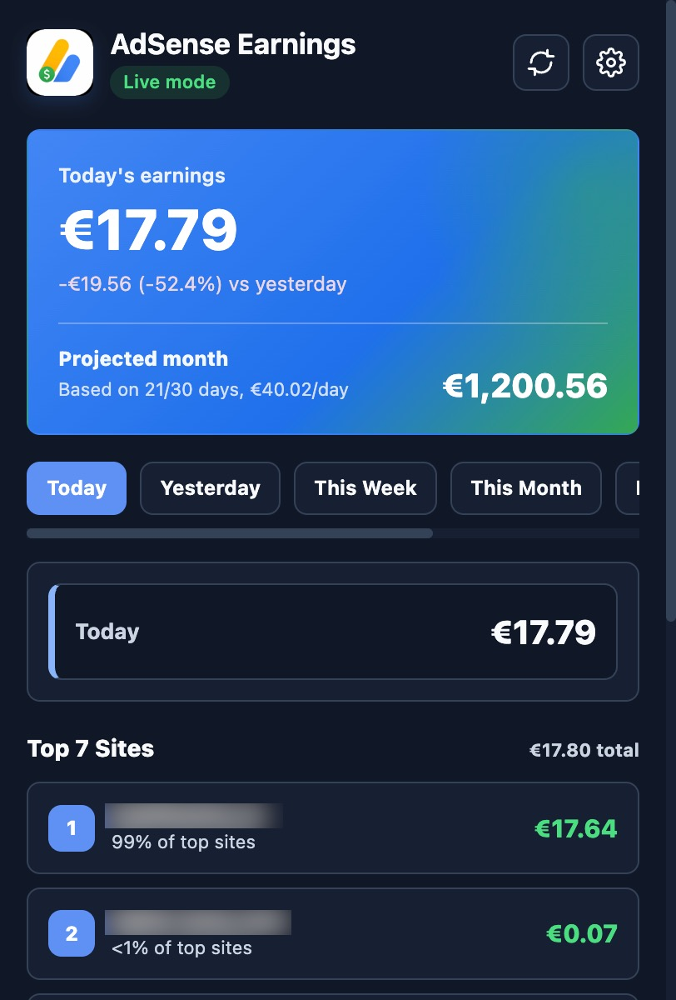

# AdSense Earnings Tracker

Chrome Manifest V3 extension for tracking real AdSense earnings from the toolbar. The extension now uses Chrome Identity OAuth and the AdSense Management API v2 for live data. Demo mode remains available only as an explicit fallback for UI testing.

## Screenshot



## Use And Sponsorship

This project is open to use, fork, and adapt under the repository license. If it
saves you time, you use it regularly, or you ship it commercially, please
sponsor the maintainer through GitHub Sponsors from the repository page.

Fair-use expectations for forks and public reuse:

- Keep the original attribution and license notice.
- Use your own Google Cloud project and OAuth Client ID.
- Do not present a fork as an official Google or AdSense product.
- Sponsor the maintainer when the project creates meaningful value for you or
  your client work.

## What Works

- First popup run requests Google authentication when OAuth is configured
- Live account discovery through `GET https://adsense.googleapis.com/v2/accounts`
- Live reporting through `reports:generate`
- Estimated earnings for:
  - Today
  - Yesterday
  - This Week
  - Last Week
  - This Month
  - Last 30 Days
  - Last Month
- Projected month value in the top card, calculated from the current monthly daily average
- Top 7 site ranking by `OWNED_SITE_DOMAIN_NAME`, synced with the selected period and deduplicated by root domain
- Configurable report currency, sent to AdSense as `currencyCode`
- Toolbar badge updates with today's earnings and configurable logo-based colors
- Cached popup state while data refreshes
- Refresh interval from 5 to 60 minutes
- Configurable week start for `This Week` and `Last Week`, defaulting to Monday
- Day, auto, and night themes
- Included PNG icon set in `icons/`

## Required OAuth Setup

Google authentication will not work with the placeholder OAuth client in
`manifest.json`. Each developer or published extension build needs a Google
Cloud project, an enabled AdSense Management API, and an OAuth Client ID whose
Chrome extension Item ID exactly matches the installed extension ID.

### OAuth Checklist

- Google account used for testing has access to the target AdSense account.
- The extension is loaded in Chrome at least once so Chrome shows its extension
  ID in `chrome://extensions`.
- Google Cloud project has Google Auth Platform/OAuth consent configured.
- AdSense Management API is enabled in the same Google Cloud project.
- OAuth client type is `Chrome extension`, not Web application or Desktop app.
- OAuth client `Item ID` is the extension ID from `chrome://extensions`.
- `manifest.json` contains the generated OAuth Client ID and the AdSense
  readonly scope.

### 1. Load The Extension And Copy Its ID

1. Open `chrome://extensions/`.
2. Enable Developer mode.
3. Click Load unpacked.
4. Select the repository root folder, the folder that contains `manifest.json`.
5. Copy the generated extension ID shown on the extension card.

Use that exact ID as the OAuth client `Item ID` in Google Cloud. Do not use the
OAuth client ID, AdSense publisher ID, AdSense account ID, or any `pub-...`
value as the Item ID.

For team development, unpacked extension IDs can differ between machines. Either
create a separate OAuth client for each developer's unpacked extension ID, or
intentionally add a stable extension `key` before creating the OAuth client.
Changing the extension ID later requires creating a new OAuth client or updating
the client to match the new ID.

### 2. Configure Google Auth Platform

In the Google Cloud project that will own the OAuth client:

1. Open Google Cloud Console: `https://console.cloud.google.com`.
2. Go to Google Auth Platform.
3. Configure Branding/OAuth consent:
   - App name: `AdSense Earnings Tracker` or your fork/app name.
   - User support email: a real support email.
   - Audience/User type: `External` for personal/public GitHub development, or
     `Internal` only if the app is limited to your Google Workspace
     organization.
   - Developer contact email: a real maintainer email.
4. If the app is External and still in testing, add every developer/tester Google
   account under Audience/Test users.
5. In Data Access/Scopes, add the narrow scope used by this extension:

```text
https://www.googleapis.com/auth/adsense.readonly
```

If Google marks the selected scope as requiring verification, keep the app in
testing for local development or complete Google's verification flow before
public distribution.

### 3. Enable The AdSense Management API

Enable the AdSense Management API in the same Google Cloud project that owns the
OAuth client.

- API name: `AdSense Management API`
- API host used by this extension: `https://adsense.googleapis.com/`
- Direct API page:
  `https://console.developers.google.com/apis/api/adsense.googleapis.com/overview`

If Google says the API was just enabled, wait a few minutes before retrying from
the extension.

### 4. Create The Chrome Extension OAuth Client

1. In Google Cloud, open Google Auth Platform -> Clients.
2. Click Create client.
3. Select `Chrome extension` as the application type.
4. Use a clear name, for example `AdSense Earnings Tracker Local`.
5. Paste the Chrome extension ID from `chrome://extensions` into `Item ID`.
6. Click Create.
7. Copy the generated Client ID.

No client secret, API key, JavaScript origin, or redirect URI is used by this
extension. Chrome Identity reads the OAuth client from the `oauth2` block in
`manifest.json` and obtains a user access token with
`chrome.identity.getAuthToken`.

### 5. Update `manifest.json`

Replace only the placeholder `oauth2.client_id` value:

```json
"oauth2": {
  "client_id": "YOUR_CLIENT_ID.apps.googleusercontent.com",
  "scopes": [
    "https://www.googleapis.com/auth/adsense.readonly"
  ]
}
```

Keep these existing permissions because the code depends on them:

```json
"permissions": [
  "storage",
  "alarms",
  "identity"
],
"host_permissions": [
  "https://adsense.googleapis.com/*"
]
```

The OAuth Client ID is not a password, but it is tied to a specific Google Cloud
project and Chrome extension ID. For public forks, prefer a local manifest change
or a fork-specific client instead of committing a personal/project-specific
client ID by accident.

### 6. Reload And Connect

1. Return to `chrome://extensions/`.
2. Click Reload on the unpacked extension.
3. Open the extension popup.
4. Click Connect Google if the prompt is not shown automatically.
5. Sign in with a Google account that has access to the AdSense account.
6. Accept the AdSense readonly permission.

The popup calls `GET https://adsense.googleapis.com/v2/accounts` first. If the
account list succeeds, report calls use
`GET https://adsense.googleapis.com/v2/{account}/reports:generate`.

### Troubleshooting OAuth

- `Set a real Google OAuth client ID in manifest.json`: the placeholder is still
  present or the extension was not reloaded after editing `manifest.json`.
- `Install the repository root with Chrome Developer mode`: the popup is open
  outside a loaded Chrome extension context.
- Google sign-in fails before consent: check that the OAuth client type is
  `Chrome extension` and that `Item ID` exactly matches the extension ID.
- Consent succeeds but API calls fail with API disabled: enable AdSense
  Management API in the same project as the OAuth client, then retry after a few
  minutes.
- Consent succeeds but no accounts are returned: sign in with a Google account
  that has access to the AdSense publisher account.
- External app is in testing and a developer cannot sign in: add that developer's
  Google account as a test user in Google Auth Platform -> Audience.
- It works for one developer but not another: the unpacked extension IDs probably
  differ. Create another Chrome extension OAuth client for the other ID or use a
  stable extension ID strategy.

## Install In Chrome

1. Open `chrome://extensions/`.
2. Enable Developer mode.
3. Click Load unpacked.
4. Select the repository root folder, the folder that contains `manifest.json`.
5. Reload the extension after editing `manifest.json`.
6. Open the popup and complete Google authentication.

## Demo Mode

Demo mode is still present for local UI checks. It is not the default. Use Settings -> Use Demo Data if you want sample data without Google authentication.

## Settings

- Currency: generated from Google's official AdSense Management API Currency
  Codes list. Live reports send the selected ISO-4217 code as AdSense
  `currencyCode`; the API defaults to the account currency only when no
  `currencyCode` is supplied.
- Week starts on: Monday or Sunday. The default is Monday.
- Theme: Day, Auto, or Night.
- Toolbar badge: Auto, Yellow / black text, or Blue / white text. Auto follows the selected theme: Day uses yellow, Night uses blue.

## Icons

The extension includes the provided iconography:

```text
icons/icon16.png
icons/icon32.png
icons/icon48.png
icons/icon128.png
```

`generate-icons.sh` is only a fallback generator and will not overwrite the included PNG set unless you run:

```bash
bash generate-icons.sh --force
```

## Development

Project structure:

```text
repo/
├── manifest.json
├── popup.html
├── popup.css
├── popup.js
├── service-worker.js
├── config.js
├── playwright.config.js
├── tests/
├── generate-icons.sh
├── icons/
└── README.md
```

Useful checks:

```bash
node --check popup.js
node --check service-worker.js
node --check config.js
python3 -m json.tool manifest.json
npm test
```

Playwright is installed locally as a dev dependency. If the managed Chromium browser is missing on another machine, run:

```bash
npx playwright install chromium
```

## API Notes

The extension calls:

- `GET /v2/accounts`
- `GET /v2/{account=accounts/*}/reports:generate`

Reports use `ESTIMATED_EARNINGS` and, for the site ranking, `OWNED_SITE_DOMAIN_NAME`. The extension requests site rankings per period so the list changes with the selected tab. Top sites are normalized to the root domain, so `www.example.com` and `example.com` are shown once instead of being summed together. AdSense may return recent earnings as estimates.

Currency handling follows the AdSense Management API reference: `reports:generate`
accepts a `currencyCode` query parameter, and Google's Currency Codes appendix is
the source of truth for accepted ISO-4217 codes. The extension keeps that list in
`popup.js` and `service-worker.js` so the UI and saved settings use the same
validation.

The projected month value uses this formula:

```text
This Month earnings / elapsed days in current month * total days in current month
```

## Privacy

- OAuth tokens are managed by Chrome Identity.
- Settings and cached report data use Chrome Storage.
- Live data is requested only from `https://adsense.googleapis.com/`.

## Official References

- Chrome Extensions OAuth guide:
  `https://developer.chrome.com/docs/extensions/how-to/integrate/oauth`
- Chrome Identity API:
  `https://developer.chrome.com/docs/extensions/reference/api/identity`
- Google Auth Platform/OAuth consent:
  `https://developers.google.com/workspace/guides/configure-oauth-consent`
- Google OAuth scopes for AdSense:
  `https://developers.google.com/identity/protocols/oauth2/scopes#adsense-management-api-v2`
- AdSense Management API getting started:
  `https://developers.google.com/adsense/management/getting_started`
- `accounts.reports.generate` reference:
  `https://developers.google.com/adsense/management/reference/rest/v2/accounts.reports/generate`
- AdSense Management API currency codes:
  `https://developers.google.com/adsense/management/appendix/currencies`
